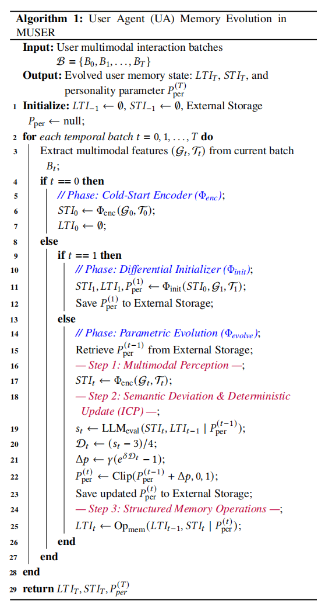
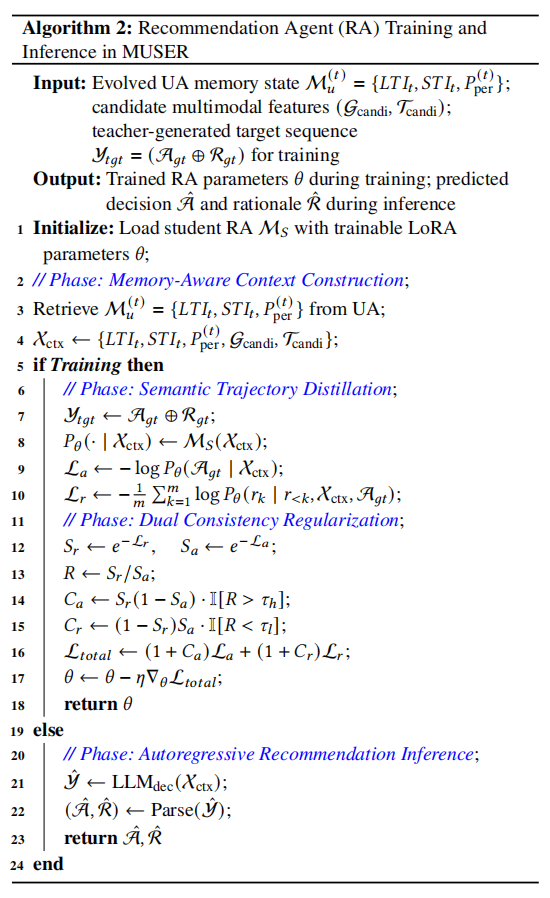

# MUSER: Memory-Augmented Multimodal Sequential Recommendation

[](https://opensource.org/licenses/MIT)
[](https://www.python.org/)
[](https://pytorch.org/)

This repository is the official implementation of the paper: **"MUSER: Memory-Augmented Multimodal Sequential Recommendation"**.

MUSER is a robust framework designed to leverage Multimodal Large Language Models (MLLMs) for 
recommendation tasks. It integrates visual perception with textual reasoning to provide accurate 
and explainable recommendations. We support a wide variety of state-of-the-art backbones, 
including **Qwen2.5-VL**, **LLaVA v1.6**, and **LFM2-VL-450M**.

## 📂 Project Structure

```text
MUSER/
├── data/                       # Dataset management
│   ├── microlens/              # MicroLens dataset & preprocessing
│   ├── movielens/              # MovieLens dataset
│   └── ninerec/                # NineRec dataset
├── train/                      # Training implementations for different backbones
│   ├── DeepSeek-OCR/           # DeepSeek-OCR integration
│   ├── InternVL2-1B/           # InternVL2 (1B) implementation
│   ├── LFM2-VL-450M/           # LFM2-VL implementation
│   ├── llava-interleave-*/     # LLaVA Interleave variants
│   ├── llava-v1.6-*/           # LLaVA v1.6 variants (Mistral, Vicuna)
│   └── Qwen2.5-VL-3B-Instruct/ # Qwen2.5-VL implementation
├── Inference/                  # Inference scripts (Generation)
│   ├── microlens/
│   ├── movielens/
│   └── ninerec/
├── test/                       # Evaluation scripts (Metrics)
│   ├── microlens/
│   ├── movielens/
│   └── ninerec/
├── save/                       # Checkpoints and logs
├── environment.yml             # Conda environment config
├── requirements.txt            # Pip requirements
└── appendix.pdf                # Supplementary materials
````

## 🛠️ Environment Setup

Please ensure you have Python 3.9+ and CUDA installed. You can set up the environment using Conda:

```bash
# 1. Create the environment
conda env create -f environment.yml

# 2. Activate the environment
conda activate muser

# 3. Install additional dependencies (if necessary)
pip install -r requirements.txt
```

## 📊 Data Preparation

We utilize three multimodal datasets: MicroLens, MovieLens, and NineRec.

### Preprocessing

Navigate to the preprocessing directory of the specific dataset to process raw data into training pairs. For example, for MicroLens:

```bash
cd data/microlens/preprocessing

# Option A: Run the Jupyter Notebook
jupyter notebook preprocessing.ipynb

# Option B: Ensure the following files are generated in the directory
# - train_pairs.csv
# - val_pairs.csv
# - test_pairs.csv
# - user_items_negs.tsv
```

## 🚀 Training

The training code is modularized by the backbone model architecture. Navigate to the `train/` directory and select the model you wish to fine-tune.

### Supported Backbones

* Qwen Series: Qwen2.5-VL-3B-Instruct
* LLaVA Series: v1.6-Mistral-7B, v1.6-Vicuna-13B, v1.6-34B, Interleave-Qwen
* InternVL Series: InternVL2-1B
* Others: DeepSeek-OCR, LFM2-VL

### Example Training Command

To train the Qwen2.5-VL model on the MicroLens dataset:

```bash
cd train/Qwen2.5-VL-3B-Instruct

# Run the training script. Modify arguments based on your hardware.
python train.py \
    --dataset microlens \
    --data_path ../../data/microlens \
    --output_dir ../../save/Qwen2.5-microlens \
    --batch_size 16 \
    --epochs 5
```

Note: Adjust the script name `train.py` if the actual file is named differently, e.g., `finetune.py` or `main.py`.

## 🔮 Inference & Evaluation

Evaluation is a two-step process: inference, which generates recommendations and explanations, and testing, which calculates ranking and explanation metrics.

### 1. Inference

Generate responses using the trained checkpoints:

```bash
cd Inference/microlens
python inference.py --model_path ../../save/Qwen2.5-microlens --output_file prediction.json
```

### 2. Testing

Evaluate the generated responses against ground truth:

```bash
cd test/microlens
python test.py --prediction_file ../../Inference/microlens/prediction.json
```

## ⚙️ Baseline Implementation Details

The following table summarizes the implementation details and hyperparameter configurations for all baselines. To ensure reproducible and fair benchmarking, we standardize common hyperparameters where applicable, while adhering to the optimal model-specific configurations reported in the original literature.

Notation: `d` denotes embedding dimension, `l` denotes learning rate, `b` denotes batch size, `L` denotes the number of layers or blocks, and `H` denotes the number of attention heads.

| Model        | Key Hyperparameter Settings & Implementation Details                                                                            |
| ------------ | ------------------------------------------------------------------------------------------------------------------------------- |
| GRU4Rec [1]      | `d=64`, `l=1e-3`, `b=1024`, hidden units=128. Loss: BPR/Cross-Entropy. Optimizer: Adam.                                         |
| SASRec [2]       | `d=64`, `l=1e-3`, `b=1024`, `L=2`, `H=1`, dropout=0.5, max_len=200. Positional Embedding: Learnable.                            |
| GRU4Rec_F [3]    | Extends GRU4Rec. Visual features projected to `d` via MLP. Concatenation strategy: Early fusion.                                |
| SASRec_F [2]     | Extends SASRec. Visual features projected to `d`. Fusion: Added to item embeddings before self-attention.                       |
| SIMTIER-MAKE [4] | `d=64`, `l=1e-3`, `b=1024`. Hierarchical retrieval. Index size=1000, retrieve top-K=50.                                         |
| MUSE [5]         | `d=64`, `l=5e-4`, `b=1024`, `L=2`. Multi-granularity intent extraction. Loss: BPR + Contrastive.                                |
| MMGCN [6]        | `d=64`, `l=1e-3`, `b=1024`, GCN layers `L=2`. Aggregation: Mean/Max Pooling. Modalities: Visual + ID.                           |
| MGAT [7]         | `d=64`, `l=5e-4`, `b=1024`, GAT layers `L=2`, heads `H=4`. Attention dropout=0.1.                                               |
| LGMRec [8]       | `d=64`, `l=1e-3`, `b=1024`, LightGCN layers `L=3`. Modality dropout=0.1. Optimizer: Adam.                                       |
| EVEN [9]         | `d=64`, `l=1e-3`. GCN layers `L=2`. Alignment regularization `lambda_align=1e-2`, temperature `tau=0.1`.                        |
| LLaVA [10]       | Zero-shot setting. Temperature=0.1, max_new_tokens=512. Prompt: "Recommend a video based on..." No training.                    |
| TALLRec [11]     | Backbone: LLaMA-7B. LoRA: `r=8`, `alpha=16`. `l=1e-4`, `b=128` with gradient accumulation. Epochs=3. Instruction tuning format. |
| MLLM-MSR [12]    | Backbone: LLaVA-1.6-7B. LoRA: `r=8`, `alpha=16`, targets=[q,k,v,o]. `l=2e-4`. Recurrent Summary Window=3.                       |
| NRT [13]         | `d=300` for word embeddings, `d_id=64`. GRU hidden=400. `l=1e-3`. Regularization weight `lambda=1e-4`.                          |
| Attn2Seq [14]    | `d=512`. Encoder: MLP. Decoder: LSTM with Attention. `l=1e-3`. User/item visual projection included.                            |
| PETER [15]       | `d=512`, `L=2`, `H=2`. `l=1e-4`. Masking: Peter-Mask. Loss: NLL for generation + CE for recommendation.                         |
| XRec [16]        | Backbone: LLaMA-7B with soft prompting or adapter. Prompt length=10. `l=1e-3` for adapters.                                     |
## 🧠 Algorithmic Details

This section presents the algorithmic workflows of the two core agents in MUSER: the User Agent (UA) and the Recommendation Agent (RA). The UA evolves long-term and short-term user memory, while the RA consumes the evolved memory state for recommendation training and inference.

### User Agent Memory Evolution


### Recommendation Agent Training and Inference


### GPTScore Evaluation

For RQ2, we use GPTScore to evaluate the semantic quality of generated explanations. To make the LLM-as-judge protocol transparent, we use GPT-4o-2024-08-06 through the OpenAI API with temperature set to 0. For each test instance, the model-generated rationale and the ground-truth rationale are provided to a fixed judge prompt.

The judge scores each explanation from five aspects: semantic alignment, factual faithfulness, preference grounding, specificity and insight, and coherence/fluency. Each aspect is assigned a score from 1 to 5. We first average the five aspect scores for each instance, normalize the result to \([0,1]\) by \((s_i - 1) / 4\), and then average the normalized scores over all test samples to obtain the final dataset-level GPTScore.

Therefore, a reported value such as 0.8427 is the average normalized GPTScore over the full test set, rather than a single direct score produced by GPT-4.

Please see `gptscore_judge.py` for the detailed implementation and the full judge prompt.


#### Case Study: GPTScore Evaluation Example

##### User Profile Generated by LLaVA

```text
The user may like the recommended movie because it contains science-fiction elements, futuristic settings, and visually impressive scenes. The story also includes emotional and philosophical themes, which may appeal to users who enjoy imaginative and thought-provoking films. In addition, the movie has a unique visual style and strong atmosphere, making it suitable for viewers interested in creative and artistic works.
```

##### User Profile Generated by Ours

```text
[Long-term Interests]
1. The user maintains a strong affinity for science fiction and fantasy themes with futuristic or otherworldly settings.
2. Romantic comedies and dramas remain a stable interest, especially relationship-centered films such as "Before Sunrise" and "Father of the Bride".
3. The user is drawn to visually striking and stylized artwork with bold colors and dynamic compositions.

[Short-term Interests]
1. The user has recently explored psychological dramas and emotional narratives, such as "Memento" and "Perfect Blue".
2. The user shows interest in anime and manga, including "Ghost in the Shell" and "Cowboy Bebop: The Movie".
3. The user also prefers unique stylized visuals, as reflected by "The Shining" and "What Dreams May Come".

[Dynamic Personality Parameter]
The updated P_per={0.57} indicates a relatively stable yet moderately exploratory pattern. The user preserves core interests in intellectually stimulating narratives, emotional depth, and expressive visual styles, while still showing controlled openness to novel themes and genres.
```

---

#### GPTScore Judge Comment Template

```markdown
##### GPTScore Evaluation Comment

The generated explanation is evaluated from the following five aspects:

1. **Semantic Alignment**: Whether the generated explanation is semantically consistent with the ground-truth rationale and captures the main preference signals.
2. **Factual Faithfulness**: Whether the explanation is faithful to the user's historical interactions and does not introduce unsupported or hallucinated claims.
3. **Preference Grounding**: Whether the explanation clearly connects the user's historical behaviors to the inferred preferences.
4. **Specificity and Insight**: Whether the explanation provides fine-grained, informative, and non-generic insights about the user's interests.
5. **Coherence and Fluency**: Whether the explanation is logically organized, readable, and linguistically fluent.

Each aspect is scored from 1 to 5. The final raw score is the average of the five aspect scores. The normalized GPTScore is calculated as:

Normalized GPTScore = (Raw Score - 1) / 4
```

---

#### GPTScore Comment for LLaVA Output

##### Aspect-level Scores

| Aspect                  | Score | Reason                                                                                                                                                                                                                                                   |
| ----------------------- | ----: | -------------------------------------------------------------------------------------------------------------------------------------------------------------------------------------------------------------------------------------------------------- |
| Semantic Alignment      | 3 / 5 | The explanation captures some relevant high-level preference signals, such as science fiction, futuristic settings, visual style, and imaginative stories. However, it remains broad and does not fully recover the user's diverse preference structure. |
| Factual Faithfulness    | 3 / 5 | The output does not contain obvious contradictions, but it also provides few concrete references to the user's historical items. Therefore, its faithfulness is only weakly supported by the generated text itself.                                      |
| Preference Grounding    | 3 / 5 | The explanation mentions several possible user preferences, but the connection between user history and preference inference is implicit. It does not clearly explain which historical behaviors support each preference.                                |
| Specificity and Insight | 2 / 5 | The explanation is fluent but relatively generic. Phrases such as “science-fiction elements,” “visually impressive scenes,” and “thought-provoking films” could apply to many users and many movies.                                                     |
| Coherence and Fluency   | 4 / 5 | The output is grammatically fluent and easy to read. The reasoning is coherent at the sentence level, although the structure is simple.                                                                                                                  |

##### Overall GPTScore for LLaVA Output

```text
Raw average score = (3 + 3 + 3 + 2 + 4) / 5 = 3.0
Normalized GPTScore = (3.0 - 1) / 4 = 0.50
```

##### Explanation of the Score

The LLaVA output receives an approximate normalized GPTScore of **0.50**. This score is mainly due to its acceptable fluency and general semantic relevance. However, the explanation lacks explicit user-history grounding, does not distinguish long-term and short-term interests, and provides limited specificity. The output reads more like a general recommendation rationale than a detailed user preference profile.

---

#### GPTScore Comment for Our Output

##### Aspect-level Scores

| Aspect                  | Score | Reason                                                                                                                                                                                                                                                                   |
| ----------------------- | ----: | ------------------------------------------------------------------------------------------------------------------------------------------------------------------------------------------------------------------------------------------------------------------------ |
| Semantic Alignment      | 4 / 5 | The generated profile captures multiple meaningful preference signals, including science fiction, fantasy, romantic dramas, psychological narratives, anime, and stylized visuals. These signals are semantically rich and consistent with the described user interests. |
| Factual Faithfulness    | 4 / 5 | The output grounds its claims in specific historical items, such as “Before Sunrise,” “Father of the Bride,” “Memento,” “Perfect Blue,” “Ghost in the Shell,” and “Cowboy Bebop: The Movie.” This makes the explanation more verifiable and faithful to user history.    |
| Preference Grounding    | 5 / 5 | The profile explicitly connects historical behaviors to inferred preferences. It separately explains stable long-term interests, recent short-term interests, and the user's dynamic personality tendency.                                                               |
| Specificity and Insight | 5 / 5 | The explanation provides fine-grained insights rather than generic genre-level statements. The dynamic personality parameter further interprets the user as relatively stable yet moderately exploratory, adding an additional layer of behavioral understanding.        |
| Coherence and Fluency   | 4 / 5 | The output is well organized into clear sections. The long-term, short-term, and personality components make the explanation easy to follow, although the format is more analytical than natural-language conversational.                                                |

##### Overall GPTScore for Our Output

```text
Raw average score = (4 + 4 + 5 + 5 + 4) / 5 = 4.4
Normalized GPTScore = (4.4 - 1) / 4 = 0.85
```

##### Explanation of the Score

Our output receives an approximate normalized GPTScore of **0.85**. This score is supported by its structured modeling of the user's preference state. The explanation gives concrete historical evidence, separates persistent and recent interests, and introduces the dynamic personality parameter to describe the user's stability and exploratory tendency. Therefore, it performs strongly in preference grounding, specificity, and insight.


## 📌 Notes

* The appendix provides additional implementation details, algorithmic descriptions, and qualitative analyses.
* Please adjust dataset paths, backbone paths, and checkpoint paths according to your local environment.
* For large MLLM backbones, gradient accumulation and distributed training are recommended.


## References

[1] Balázs Hidasi, Alexandros Karatzoglou, Linas Baltrunas, and Domonkos Tikk. 2016. Session-based Recommendations with Recurrent Neural Networks. International Conference on Learning Representations.

[2] Wang-Cheng Kang and Julian McAuley. 2018. Self-Attentive Sequential Recommendation. 2018 IEEE International Conference on Data Mining. 197--206.

[3] Balázs Hidasi, Massimo Quadrana, Alexandros Karatzoglou, and Domonkos Tikk. 2016. Parallel Recurrent Neural Network Architectures for Feature-rich Session-based Recommendations. Proceedings of the 10th ACM Conference on Recommender Systems. 241--248.

[4] Xiang-Rong Sheng, Feifan Yang, Litong Gong, Biao Wang, Zhangming Chan, Yujing Zhang, Yueyao Cheng, Yong-Nan Zhu, Tiezheng Ge, Han Zhu, Yuning Jiang, Jian Xu, and Bo Zheng. 2024. Enhancing Taobao Display Advertising with Multimodal Representations: Challenges, Approaches and Insights. Proceedings of the 33rd ACM International Conference on Information and Knowledge Management. 4858--4865.

[5] Bin Wu, Feifan Yang, Zhangming Chan, Yu-Ran Gu, Jiawei Feng, Chao Yi, Xiang-Rong Sheng, Han Zhu, Jian Xu, Mang Ye, et al. 2025. MUSE: A Simple Yet Effective Multimodal Search-Based Framework for Lifelong User Interest Modeling. arXiv preprint arXiv:2512.07216.

[6] Yinwei Wei, Xiang Wang, Liqiang Nie, Xiangnan He, Richang Hong, and Tat-Seng Chua. 2019. MMGCN: Multi-modal Graph Convolution Network for Personalized Recommendation of Micro-video. Proceedings of the 27th ACM International Conference on Multimedia. 1437--1445.

[7] Zhulin Tao, Yinwei Wei, Xiang Wang, Xiangnan He, Xianglin Huang, and Tat-Seng Chua. 2020. MGAT: Multimodal Graph Attention Network for Recommendation. Information Processing & Management. 102277.

[8] Zhiqiang Guo, Jianjun Li, Guohui Li, Chaoyang Wang, Si Shi, and Bin Ruan. 2024. LGMRec: Local and Global Graph Learning for Multimodal Recommendation. Proceedings of the AAAI Conference on Artificial Intelligence. 8454--8462.

[9] Yuxin Qi, Quan Zhang, Xi Lin, Xiu Su, Jiani Zhu, Jingyu Wang, and Jianhua Li. 2025. Seeing beyond Noise: Joint Graph Structure Evaluation and Denoising for Multimodal Recommendation. Proceedings of the AAAI Conference on Artificial Intelligence. 12461--12469.

[10] Haotian Liu, Chunyuan Li, Qingyang Wu, and Yong Jae Lee. 2023. Visual Instruction Tuning. Advances in Neural Information Processing Systems. 34892--34916.

[11] Keqin Bao, Jizhi Zhang, Yang Zhang, Wenjie Wang, Fuli Feng, and Xiangnan He. 2023. TALLRec: An Effective and Efficient Tuning Framework to Align Large Language Model with Recommendation. Proceedings of the 17th ACM Conference on Recommender Systems. 1007--1014.

[12] Yuyang Ye, Zhi Zheng, Yishan Shen, Tianshu Wang, Hengruo Zhang, Peijun Zhu, Runlong Yu, Kai Zhang, and Hui Xiong. 2025. Harnessing Multimodal Large Language Models for Multimodal Sequential Recommendation. Proceedings of the AAAI Conference on Artificial Intelligence. 13069--13077.

[13] Piji Li, Zihao Wang, Zhaochun Ren, Lidong Bing, and Wai Lam. 2017. Neural Rating Regression with Abstractive Tips Generation for Recommendation. Proceedings of the 40th International ACM SIGIR Conference on Research and Development in Information Retrieval. 345--354.

[14] Li Dong, Shaohan Huang, Furu Wei, Mirella Lapata, Ming Zhou, and Ke Xu. 2017. Learning to Generate Product Reviews from Attributes. Proceedings of the 15th Conference of the European Chapter of the Association for Computational Linguistics. 623--632.

[15] Lei Li, Yongfeng Zhang, and Li Chen. 2021. Personalized Transformer for Explainable Recommendation. Proceedings of the 59th Annual Meeting of the Association for Computational Linguistics and the 11th International Joint Conference on Natural Language Processing. 4947--4957.

[16] Qiyao Ma, Xubin Ren, and Chao Huang. 2024. XRec: Large Language Models for Explainable Recommendation. Findings of the Association for Computational Linguistics. 391--402.


```
```
